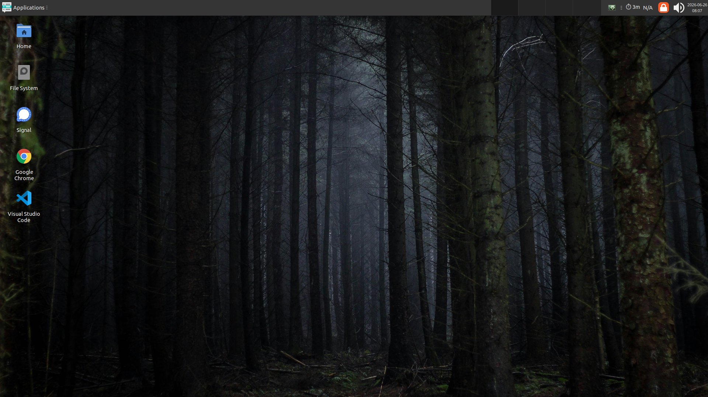

# container-debian-desktop 🖥️

A persistent Debian Trixie XFCE desktop container with TigerVNC, noVNC, and a Helm chart for Kubernetes deployment.

[](https://github.com/flaccid/container-debian-desktop/actions/workflows/container_image.yml)
[](https://hub.docker.com/r/flaccid/debian-desktop)
[](https://hub.docker.com/r/flaccid/debian-desktop/tags)
[](https://github.com/flaccid/container-debian-desktop/releases)
[](LICENSE)



## Overview

This repository packages a lightweight, persistent Linux desktop environment for the browser. It runs as a non-root user (`admin`, UID 1000) and avoids the permission headaches typical of PVC-bound desktop containers.

## Features ✨

- **Debian Trixie** — modern, stable base (`debian:trixie-slim`)
- **XFCE Desktop** — lightweight and efficient
- **TigerVNC** — robust VNC server with reliable session management
- **noVNC** — browser-based VNC client via WebSocket (`websockify`)
- **Automatic Scaling** — patched to default to "Remote resizing" mode
- **Persistence-ready** — uses a skeleton directory and entrypoint script to populate fresh PVCs at `/home/admin`
- **Non-root user** — runs strictly as `admin` (UID 1000) with passwordless `sudo` (uses `gosu` for clean privilege dropping)
- **Self-signed HTTPS** — noVNC served over HTTPS/WSS on port 6901
- **Audio Streaming** — desktop audio captured via PulseAudio null-sink, encoded to WebM/Opus by GStreamer, streamed to the browser via a separate WebSocket (port 6902) through nginx sidecar at `/audio/`

## Pre-installed Applications 📦

The image comes with several productivity tools ready to use:

- **Google Chrome** — with `--no-sandbox` patches for container compatibility
- **Signal Desktop** — secure messaging
- **Visual Studio Code** — full-featured IDE
- **Guake** — drop-down terminal (toggled with `F12`; autostarts via `~/.config/autostart/guake.desktop`)
- **Git** — version control (`git version`)
- **GitHub CLI** — GitHub from the terminal (`gh`)
- **GitLab CLI** — GitLab from the terminal (`glab`)
- **OpenCode** — open source AI coding agent (`opencode`)
- **Go** — Go programming language compiler (`go version`)
- **Helm** — Kubernetes package manager (`helm`)
- **kubectl** — Kubernetes CLI (`kubectl`)
- **kubectx/kubens** — Kubernetes context/namespace switchers (`kubectx`, `kubens`)
- **k9s** — Kubernetes TUI dashboard (`k9s`)
- **Terraform** — infrastructure as code (`terraform`)
- **AWS CLI** — Amazon Web Services CLI v2 (`aws`)
- **taws** — Terminal UI for browsing AWS resources (`taws`)
- **Google Cloud CLI** — Google Cloud Platform CLI (`gcloud`)
- **joe** — Joe's Own Editor, a light text editor (`joe`)
- **yq** — portable YAML/JSON processor (`yq`)
- **tfswitch** — Terraform version switcher (`tfswitch`)
- **Make** — build automation tool (`make`)
- **XFCE Utilities** — including Thunar file manager, XFCE terminal, and XFCE task manager
- **Fonts** — Ubuntu, JetBrains Mono, Cantarell, Noto Color Emoji, and Noto fonts for broad Unicode script coverage

## Whitelabelling 🏷️

The noVNC interface is whitelabelled with Debian branding:

- **Sidebar logo** — Debian swirl (openlogo-debianV2.svg) replaces the "noVNC" text in the left control bar
- **Connect dialog logo** — Full Debian logo (Debian-OpenLogo.svg) with swirl and wordmark replaces the center "noVNC" text
- **Dark theme** — Custom CSS (`config/novnc-dark.css`) provides a uniform dark appearance across all UI elements

Both logos are SVG files loaded as CSS backgrounds, copied into the container at build time.

The noVNC web interface also includes **Progressive Web App (PWA)** support:
- **Favicon** — Debian swirl SVG replaces the default noVNC favicon
- **Web App Manifest** — enables "Install" prompt in Chrome/Edge with Debian-branded icons
- **Service Worker** — network-first caching strategy for offline resilience

## Customizations 🎨

- **Dark Theme** — Adwaita-dark set as the default system theme
- **Custom Wallpaper** — persistent, modern background pre-configured
- **Clean Layout** — single-panel configuration (bloat removed)
- **Desktop Icons** — launchers for main apps pre-placed on the desktop
- **Keyboard Shortcuts** — custom tiling and system shortcuts (see [keyboard-shortcuts.md](docs/keyboard-shortcuts.md))
- **Icon Theme** — Papirus-Dark for modern, consistent application icons
- **Fonts** — Ubuntu font family for UI text, JetBrains Mono for monospace (terminal/code), Cantarell also available
- **PWA** — Debian-branded favicon, manifest, and service worker for installable desktop experience

## Quick Start 🚀

For a step-by-step guide covering both Kubernetes (Helm) and Docker deployment — including OAuth setup, persistence, audio, and troubleshooting — see [**Getting Started**](docs/getting-started.md).

### Build the image

```bash
make docker-build
```

### Run locally

```bash
make docker-run
```

Then open **https://localhost:6901** in a browser (accept the self-signed cert warning).

> If you get TTY issues, use `make docker-run OPTS=""` or run without `-it`:
> ```bash
> docker run --rm -p 6901:6901 flaccid/debian-desktop:latest
> ```

### Run with a persistent volume

```bash
docker run -p 6901:6901 -v desktop_data:/home/admin flaccid/debian-desktop:latest
```

No password is required — VNC authentication is disabled.

## Audio Streaming 🔊

Desktop audio is automatically streamed to the browser through a separate out-of-band channel:

1. **PulseAudio null-sink** (`virtual_sink`) — captures all audio output from desktop applications
2. **GStreamer pipeline** (`audio-proxy.sh`) — encodes raw PCM to WebM/Opus on-the-fly
3. **WebSocket relay** (websockify on port `6902`) — proxies encoded audio to the browser
4. **Client-side player** (`audio-plugin.js`) — receives audio via WebSocket and plays it using the Media Source API

### How it works

In the "Settings" panel of the noVNC client, expand "Audio Plugin" — audio is enabled by default. After connecting to the desktop, any audio played by applications (YouTube in Chrome, notifications, etc.) will be audible in the browser.

Controls in the Audio Plugin settings:
- **Enabled** toggle — enable/disable audio streaming
- **Codec** — WebM/Opus (default, broadly supported) or MP4/AAC
- **Bitrate** — 64/96/128/192 kbps (96 kbps default)
- **WebSocket** — host, port, and path for the audio stream (defaults to VNC host on path `/audio/`)

> Chrome/Edge autoplay policy: audio playback starts on the first user click inside the session. This is handled automatically by the plugin.

### Troubleshooting

- If you hear no audio, open the noVNC Settings panel and ensure "Audio Plugin → Enabled" is checked
- Check that `/audio/` is proxied correctly by inspecting the nginx ConfigMap in the Helm chart
- In the container, verify PulseAudio is running: `docker exec <container> pactl info`
- Audio only works when the VNC session is connected — it stops on disconnect

## Kubernetes Deployment ☸️

### Using the Helm chart

The chart at `charts/debian-desktop/` deploys everything:

- **StatefulSet** — desktop container + nginx sidecar
  - `entrypoint.sh` — populates fresh PVCs from `/etc/skel/admin` on first boot
  - `fix-permissions` initContainer — `chown -R 1000:1000 /home/admin` on PVC mount
  - nginx sidecar — proxies `http://localhost:6901` on port 8080 (handles WebSocket upgrade and serves `index.html`)
  - desktop container — runs `vncserver` + `websockify` as `admin` (via `gosu`)
- **PersistentVolumeClaim** — 5Gi default (upgradable), mounted at `/home/admin`
- **Service** — exposes port 8080 (nginx)
- **Ingress** — nginx ingress controller with oauth2-proxy auth
- **oauth2-proxy** — optional SSO subchart

### Image Tagging & Caching 🏷️

To avoid stale image caching on cluster nodes, CI tags each build with a semantic version tag (`v0.x.y`) and `latest`. The `imagePullPolicy: Always` alone is insufficient when the `:latest` tag resolves to the same digest — always use a specific version tag in production.
#### Install

```bash
# 1. Copy values and fill in oauth2-proxy secrets
cp charts/debian-desktop/values.yaml helm-values.yaml
# Edit helm-values.yaml with your secrets

# 2. Install
make helm-install
```

#### Upgrade

```bash
make helm-upgrade
```

#### Render templates

```bash
make helm-render
```

### Architecture

```
Browser ──HTTPS──> Ingress ──HTTP──> nginx sidecar (:8080)
  / ──────────────────────────────────> websockify (:6901) ──TCP──> TigerVNC (:5901)
  /audio/ ────────────────────────────> websockify (:6902) ──TCP──> audio-proxy (:5711) ──TCP──> PulseAudio (:4711)
```

The nginx sidecar sits inside the pod, serves the custom `index.html`, and proxies `/` to websockify on `localhost:6901` (plain HTTP — TLS is handled by the Ingress). The `/audio/` path is proxied to a second websockify on `6902`, which connects to the audio proxy (GStreamer encoding PulseAudio raw PCM to WebM/Opus). WebSocket upgrades for both noVNC and audio are passed through transparently. The Ingress terminates external HTTPS and delegates auth to oauth2-proxy.

### Signing Out 🔒

When deployed via Helm, a **Sign Out** button appears in the noVNC control bar (between Settings and Disconnect). Clicking it opens the logout page in a new tab, where a single click signs you out of both oauth2-proxy and Google. After signing out, you'll be prompted to sign in again to access the desktop.

The logout page is served at `/logout` by the nginx sidecar ConfigMap and is only available in Helm deployments — it is not present in the Docker image.

### Publishing chart updates

After any chart change:

```bash
make helm-package && make helm-index
```

Commit the new `.tgz` and `index.yaml` — the Helm repo is served via GitHub Pages at `https://flaccid.github.io/container-debian-desktop/`.

## Configuration Management ⚙️

### Entrypoint (`entrypoint.sh`)

On container start, the entrypoint detects whether it is running as `root` or as the `admin` user:

1. **First-run detection** — checks if `~/.config/xfce4` exists. If missing, it copies the entire skeleton (`/etc/skel/admin/`) into `/home/admin`, making autostart `.desktop` files executable.
2. **Privilege drop** — when running as `root`, it uses `gosu` to re-execute the container command as `admin`.
3. **Pass-through** — already running as `admin`, it executes the command directly.

This approach means fresh PVCs are populated automatically, while existing PVCs (post first-run) preserve user data across pod restarts.

### Screensaver & Lock Screen 🔒

The **screensaver is disabled by default** (`saver/enabled=false`) to prevent auto-lock on idle — the real danger since it can happen when the user walks away. **Lock screen is enabled** (`lock/enabled=true`) — the panel tray button and `Ctrl+Alt+L` work after setting a password. Manual locking is safe to enable; only auto-lock on idle is disabled.

The idle timeout is pre-configured to **1 hour** so it's ready if you re-enable the screensaver via the GUI.

To enable the screensaver and/or lock screen from the desktop:

1. Open the XFCE menu → **Settings** → **Screensaver**
2. Check **"Enable Screensaver"** (optional) and set your desired idle timeout
3. Check **"Lock screen"** (under the Lock tab) if you want automatic locking on idle
4. Close the dialog — changes take effect immediately

Setting a password (required for lock screen to actually prevent access):

```bash
kubectl exec <pod> -c desktop -- bash -c 'passwd admin'
```

The password hash is synced to the PVC-backed `/home/admin/.shadow` every 2 minutes, so it survives pod restarts. No session restart needed.

> **Important**: Debian's PAM does not permit empty passwords (`nullok` is absent from `pam_unix.so`). Without setting a password, any lock screen attempt will be denied and the user will be stuck — this is why the screensaver is disabled by default.

### Reset Script (`reset-xfce4`)

If you need to restore the default XFCE configuration from the skeleton on an existing PVC (e.g., after a config change or to pick up new shortcuts/autostart entries):

```bash
# Exec into the pod and run with the correct HOME
kubectl exec -n <namespace> <pod> -c desktop -- bash -c 'HOME=/home/admin /usr/local/bin/reset-xfce4'
```

The script backs up the current `~/.config/xfce4`, restores all XFCE settings, autostart entries, and VNC startup files from the skeleton, then restarts the XFCE components.

## CI/CD 🔄

On push to `main` or a semver tag (`v*`), GitHub Actions builds and pushes `flaccid/debian-desktop` to Docker Hub with the following tags:

- `latest` — most recent build on `main`
- `sha-<short>` — exact commit SHA for traceability
- `v0.x.y` — semver release tags (pushed only when a matching `git tag` exists)

Chart version bumps and `index.yaml` updates are done manually.

## Build & Make Targets 🛠️

| Target | Description |
|---|---|
| `make docker-build` | Build the Docker image |
| `make docker-build-clean` | Build with `--no-cache` |
| `make docker-run` | Run container locally |
| `make docker-push` | Push to Docker Hub |
| `make docker-exec-shell` | Open a shell in running container |
| `make helm-lint` | Validate the chart |
| `make helm-install` | Install from local chart |
| `make helm-upgrade` | Upgrade deployed release |
| `make test` | Run all tests |
| `make test-structure` | Container structure tests (82 assertions) |
| `make test-bats` | Shell script unit tests (22 bats tests) |
| `make test-smoke` | Runtime integration smoke test |
| `make test-helm` | Helm chart lint |
| `make helm-package` | Package chart into `.tgz` |
| `make helm-index` | Update Helm repo index |

## License and Authors

- Author: Chris Fordham (<chris@fordham.id.au>)

```text
Copyright 2026, Chris Fordham

Licensed under the Apache License, Version 2.0 (the "License");
you may not use this file except in compliance with the License.
You may obtain a copy of the License at

    http://www.apache.org/licenses/LICENSE-2.0

Unless required by applicable law or agreed to in writing, software
distributed under the License is distributed on an "AS IS" BASIS,
WITHOUT WARRANTIES OR CONDITIONS OF ANY KIND, either express or implied.
See the License for the specific language governing permissions and
limitations under the License.
```
